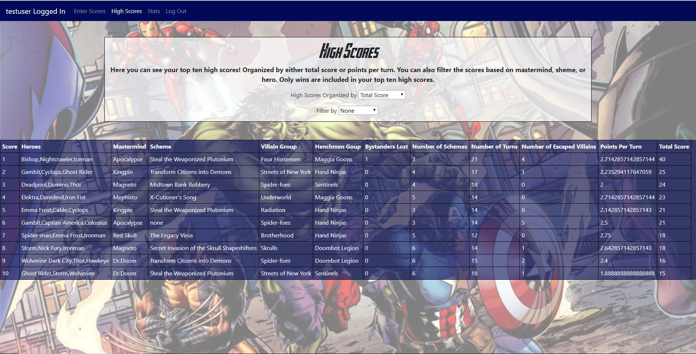

# LegendaryTracker

## Demo

https://sheltered-shore-84644.herokuapp.com/

## Main Login Page

## Add Scores Page

## High Scores Page

## Stats Page

##Description

This app is designed for people who enjoy playing the marvel legendary board game solo. This app allows users to login and enter their match data and track those matches. The user can see their top ten high scores and a history of their wins and losses. The user can also update or delete a match by clicking on a score from the stats page. The scores are organized by either total points (the way the game suggest tracking your score) or by points per turn (unoffical way of tracking scores) which is total score divided by number of turns. Having these two ways of tracking scores allows the user to try out different strategies depending on which scoring method they prefer.

## Built With

HTML, CSS, JavaScript, JQuery, node js, express, passport, and jwt authentication

## APIs Used

Marvel Api

## Created by 

Michael Peterson
